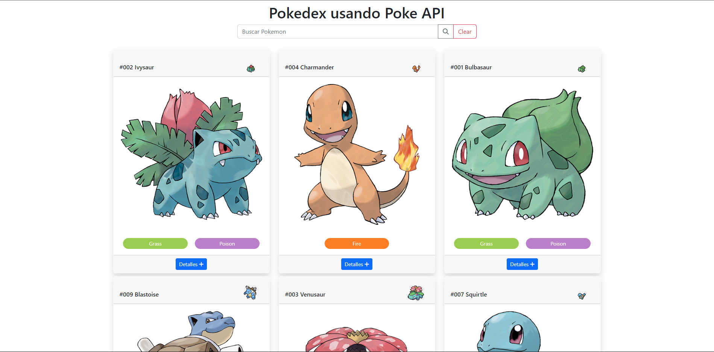
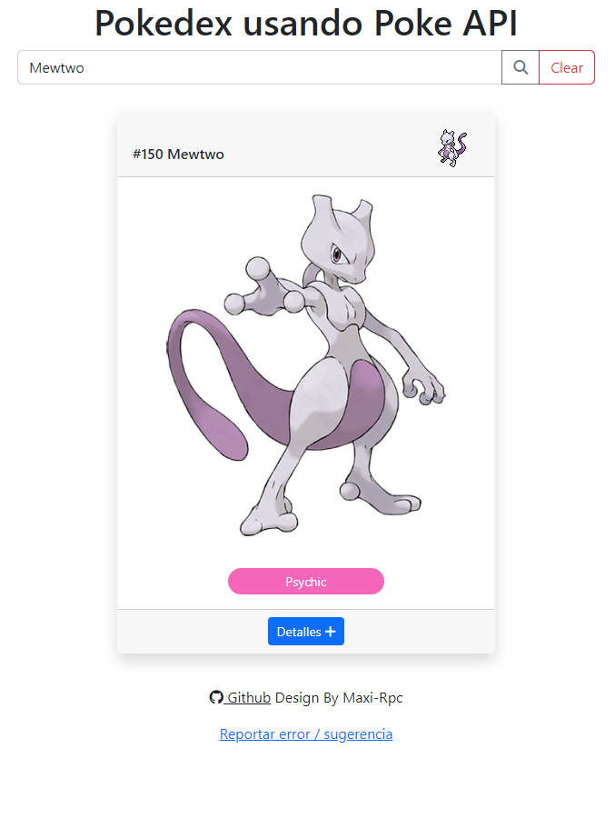
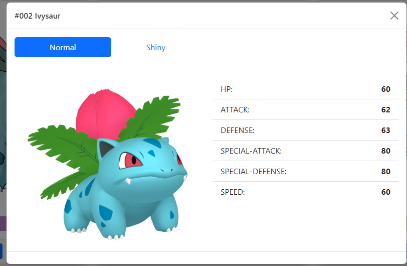

# Pokedex-Js

## Tech utilizadas:

- HTML
- CSS
- Javascript
- Bootstrap

Se realiza pokedex en Js utilizando la [pokeApi](https://pokeapi.co/)

To DO
- [x] Home Page
- [x] Search Bar
- [x] Card pokemon
- [x] Api poke api
- [x] Modal con detalles
- [x] Test prev 1
- [ ] ordenar por num ID
- [ ] filtrar por tipos

#### Images

**Home**

    

**Buscar Pokemon**

    

**Detalles**

    

